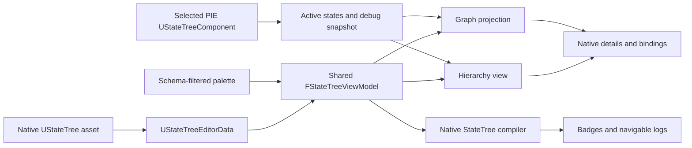

<!-- markdownlint-disable MD033 MD041 -->

<div align="center">
  
# State Tree Extensions Tool

### See the whole flow. Edit every transition. Debug the live tree.

[](https://www.unrealengine.com/)
[](./MCStateTreeExtensionsTool.uplugin)
[](./MCStateTreeExtensionsTool.uplugin)
[](./Source)

**English** | [한국어](./README_KO.md)

</div>

State Tree Extensions Tool is an Unreal Engine editor plugin for authoring and debugging native StateTree assets from one dockable workspace. It adds a graph view of state transitions and conditions while retaining the hierarchy, property editors, compiler, transactions, and asset format provided by Unreal Engine.

The plugin does not translate a StateTree into a custom format. `UStateTree` and its editor data remain the source of truth, and the graph is rebuilt as an editor projection of that data. Changes made here stay synchronized with the standard StateTree workflow.

**State Tree Extensions Tool gives you:**

- **A complete transition map** with state nodes, grouped edge labels, hierarchy links, special transition targets, and direct retargeting.
- **Focused subgraphs** for transition conditions, state enter conditions, and task parameters.
- **Native StateTree editing** through Unreal's `FStateTreeViewModel`, editing subsystem, details customizations, transactions, and compiler.
- **A searchable authoring palette** for states, tasks, conditions, evaluators, and considerations.
- **Live PIE inspection** with explicit instance selection, active-state highlighting, breakpoints, call stacks, and reflected variable values.
- **Actionable diagnostics** with graph error badges and log entries that navigate back to the affected state, transition, task, or condition.

## In action

<div align="center">
  
</div>

The default workspace places the graph and log on the left, the StateTree hierarchy in the center, and assets, palette, and details on the right. Every panel is registered with a local tab manager, so the layout can be rearranged like other Unreal Editor tools.

## Feature overview

| Area | What it supports |
| --- | --- |
| Assets | Browse native StateTree assets, create a StateTree through the standard schema dialog, locate it in the Content Browser, compile, and save |
| Hierarchy | Search, select, add child or sibling states, drag states, copy/paste, rename, delete, and enable or disable states |
| Palette | States, tasks, conditions, evaluators, and considerations from allowed C++ structs and Blueprint classes |
| Transition graph | State and hierarchy nodes, grouped transition rows, trigger selection, add/remove, drag retargeting, and manual placement |
| Focused graphs | Transition conditions, enter conditions, and task parameters with breadcrumb navigation |
| Details | Native state, task, node, and asset details with StateTree property-binding handlers |
| Diagnostics | Native validation and compilation, issue mapping, red graph badges, summaries, notifications, and navigable logs |
| PIE debugging | Running-instance picker, active-state highlighting, session breakpoints, call stack, global nodes, task values, and linked-tree frames |

## Quick start

1. Enable the plugin and restart Unreal Editor.
2. Open **Tools > State Tree Extensions Tool**.
3. Select a StateTree in **StateTree Assets**, or choose **New StateTree**.
4. Add states from the hierarchy or drag them from **State Palette**.
5. Drop tasks, conditions, and considerations onto a state. Evaluators are added at asset scope.
6. Connect states in **Transition Graph** and choose the transition trigger.
7. Double-click a transition row to edit its condition graph, or double-click a state to edit its enter conditions.
8. Compile the asset and use graph badges or the log to locate validation problems.
9. Start PIE, open **PIE Actors**, and select the exact running component to observe.
10. Select a graph state and press <kbd>F9</kbd> to toggle a breakpoint.

## Transition graph

The transition graph is based on Unreal's `UAIGraph`, `UEdGraphSchema`, and `SGraphEditor` stack. It is a view over native StateTree editor data rather than a serialized duplicate.

- **State nodes** show the state, its tasks, selection state, active PIE state, breakpoint state, and compile-error state.
- **Hierarchy connections** make parent/child structure visible alongside runtime transitions.
- **Transition edges** collect transitions between the same source and destination into labeled rows.
- **Trigger picker** chooses the transition trigger before a new connection is committed.
- **Retargeting** moves a transition to another destination without recreating unrelated data.
- **Special targets** preserve native StateTree links such as next, parent, success, and failure semantics.
- **Manual layout** is persisted by stable state GUID instead of transient graph-node pointers.
- **Graph edits** use scoped transactions, mark the asset modified, and notify the shared view model.

Selecting a state or task in the graph synchronizes the hierarchy and details views. Deleting graph selections can remove selected tasks, states, transition rows, or condition nodes according to the active graph mode.

## Condition and task graphs

Focused graphs keep dense nested data readable without replacing the engine's underlying arrays.

### Transition conditions

Double-click a transition edge row to open its condition graph. Each condition becomes a graph node with its expression operator, description, and native details editor. Conditions can be added from the palette, deleted, reordered through expression indentation, and edited in place.

### Enter conditions

Double-click a state node to open the same focused editor for that state's enter conditions. The graph retains the state context and uses a breadcrumb to return to the transition overview.

### Task parameters

Task rows can open a task-parameter graph. This exposes task data and property bindings in the same graph-oriented workflow and keeps task selection synchronized with the hierarchy's task details.

## Hierarchy and palette

The hierarchy follows Unreal Engine's native StateTree editing contracts:

- Parent/child and sibling insertion use the shared `FStateTreeViewModel`.
- Search keeps ancestors of matching states visible so context is not lost.
- State rows expose tasks and transition summaries in the tree.
- Context actions cover add child, add sibling, copy, paste as child, rename, delete, and enabled state.
- All structural actions participate in Unreal Editor undo and redo.

The palette builds its entries from the StateTree node class cache and applies the active StateTree schema's `IsStructAllowed` and `IsClassAllowed` filters. It supports native structs and Blueprint node classes for:

- State types
- Tasks
- Conditions
- Evaluators
- Considerations

Drag-and-drop routes each item to its native destination: tasks, conditions, and considerations belong to a state; evaluators belong to the asset's global editor data.

## Compile and diagnostics

Compilation uses Unreal Engine's StateTree validation and compiler rather than a custom validator.

1. The asset is validated and compiled through the editor subsystem.
2. Compiler messages are collected into a plugin issue list.
3. State, transition, task, and condition GUIDs are mapped back to graph targets.
4. Affected nodes and edge rows receive red error badges and combined tooltips.
5. Entries are forwarded to **StateTree Log** and to Unreal's standard `StateTreeCompiler` message listing.

Double-clicking a mapped log entry navigates to the related graph node. If the issue belongs to a transition or enter condition, the tool opens the focused condition graph before selecting the exact node.

The compile toolbar also uses Unreal's global StateTree **Save on Compile** setting:

- **Never**
- **On Success Only**
- **Always**

Saving compiles modified editor data first and uses Unreal Editor's normal package save and source-control checkout flow.

## PIE debugging

Runtime observation is intentionally PIE-only. The plugin does not spawn or own a separate preview world.

### Select one instance

The **PIE Actors** menu enumerates running `UStateTreeComponent` instances across PIE worlds. Selecting an entry:

- switches the editor to the StateTree used by that component;
- pins observation to that exact component;
- prevents highlights from being merged across multiple actors;
- clears itself safely when PIE ends or the component becomes invalid.

### Active-state highlighting

The selected instance's active state GUIDs are polled and shown in both the hierarchy and graph. If no instance is selected, the asset does not match, or execution stops, highlighting returns an empty set.

### State breakpoints

Select one or more state graph nodes and press <kbd>F9</kbd>. Breakpoints are session-transient and are not written into the StateTree asset. A hit occurs when the observed instance newly enters the marked state; the PIE world pauses through Unreal's editor debug-pause mechanism.

Clearing a breakpoint resumes a pause caused by that breakpoint and refreshes the debug panel. Transition edges and condition nodes do not accept state breakpoints.

### Debug snapshot

The **Debug** tab builds a live snapshot from the observed component:

- root-to-leaf active state call stack;
- global evaluators and global tasks;
- tasks owned by active states;
- linked StateTree frames, labeled separately;
- reflected instance properties rendered as `Name = Value` rows;
- frozen values while paused at a breakpoint.

Call-stack rows belonging to the currently edited asset can be selected to synchronize the tree, details, and graph. Linked-asset frames are displayed for context without pretending that their states belong to the current graph.

## Workspace reference

| Tab | Purpose |
| --- | --- |
| State Tree | Searchable native hierarchy, state/task selection, structural editing |
| StateTree Assets | Asset picker and New StateTree action |
| State Palette | Draggable states and allowed node types |
| Transition Graph | Transition overview plus condition/task subgraphs |
| Details | Selected state, task, transition, or condition properties |
| Asset Details | StateTree editor-data properties |
| StateTree Log | Edit, transition, condition, compile, and breakpoint messages |
| Debug | PIE call stack and instance values |

The menu bar mirrors familiar asset editors: **File**, **Edit**, **Asset**, **Window**, **Tools**, and **Help**. It includes commands to open the asset picker, save, undo/redo, compile, browse to the asset, open the official StateTree editor, restore tabs, and open the StateTree documentation.

## How it works



The controller owns the selected asset and shared view model, mediates panel synchronization, collects logs, maps compiler messages, and observes the selected PIE component. The hierarchy and graph never maintain an independent runtime definition of the StateTree.

## Source layout

| Component | Responsibility |
| --- | --- |
| `MCStateTreeExtensionsToolEditorModule` | Plugin startup, Slate style, and the Tools-menu nomad tab |
| `SMCStateTreeExtensionsToolWindow` | Menus, toolbar, status, dock layout, and panel lifetime |
| `FMCStateTreeExtensionsToolController` | Asset/view-model ownership, compile/save, edit fan-in, PIE observation, breakpoints, and debug snapshots |
| `SMCStateTreeHierarchyView` / `SMCStateTreeStateRow` | Native hierarchy authoring and state/task presentation |
| `SMCStateTreeItemPalette` | Class discovery, schema filtering, drag-and-drop payloads, and Blueprint creation |
| `UMCStateTreeTransitionGraph` | State and transition projection, graph schema, edits, and position persistence |
| `UMCStateTreeConditionGraph` | Transition conditions, enter conditions, task parameters, and expression edits |
| `SMCStateTreeTransitionGraphPanel` | Graph modes, breadcrumbs, commands, selection sync, and palette drops |
| `SMCStateTreeTransitionGraphNode` | Slate widgets for state, edge, condition, result, and parameter nodes |
| `SMCStateTreeLogPanel` | Buffered categorized log with navigation targets |
| `SMCStateTreeDebugView` | Live PIE call stack and variable display |
| `MCStateTreeVersionCompat` | API differences across supported engine versions |
| `MCStateTreeExtensionsToolLayoutExt` | UE 5.8 editor-data extension for asset-owned graph positions |

## Compatibility

| Unreal Engine | Status | Manual graph layout storage |
| --- | --- | --- |
| 5.5.4 | Supported | Per-user editor settings |
| 5.6 | Supported | Per-user editor settings |
| 5.7 | Supported | Per-user editor settings |
| 5.8 | Supported | StateTree editor-data extension stored with the asset |

The main build rules define compatibility gates for APIs introduced in UE 5.6, 5.7, and 5.8. On UE 5.8, the editor module conditionally depends on the small `MCStateTreeExtensionsToolLayoutExt` module. Earlier versions use `UMCStateTreeExtensionsToolUserSettings` for graph positions.

> [!IMPORTANT]
> Layouts stored in per-user settings are local to that editor configuration. UE 5.8 asset-extension layouts travel with the StateTree asset and are excluded from the compiled StateTree hash.

## Requirements

- Unreal Engine 5.5.4, 5.6, 5.7, or 5.8
- A C++ Unreal Engine project and matching compiler toolchain
- Unreal Engine **StateTree** plugin
- Unreal Engine **Gameplay StateTree** plugin
- An Editor target; this plugin is not a runtime or shipping module

## Installation

1. Close Unreal Editor.
2. Copy or clone the repository into `YourProject/Plugins/MCStateTreeExtensionsTool`.
3. Confirm that `MCStateTreeExtensionsTool.uplugin` is directly inside that directory.
4. Regenerate the project's IDE files.
5. Build the project using **Development Editor** for your platform.
6. Open the project and enable **State Tree Extensions Tool** under **Edit > Plugins > Editor**.
7. Restart Unreal Editor when prompted.

```text
YourProject/
`-- Plugins/
    `-- MCStateTreeExtensionsTool/
        |-- MCStateTreeExtensionsTool.uplugin
        |-- Resources/
        `-- Source/
```

> [!NOTE]
> Prebuilt binaries must match the exact Unreal Engine build and C++ toolchain. Build the plugin from source when compatible binaries are not included.

## Build from source

Use the standard Unreal Engine plugin workflow:

1. Install the C++ workload required by your Unreal Engine version.
2. Generate project files from the host project's `.uproject` file.
3. Open the generated solution or workspace.
4. Select **Development Editor** and your target platform.
5. Build the host project's Editor target.

The plugin depends on editor modules including `StateTreeEditorModule`, `GraphEditor`, `AIGraph`, `PropertyEditor`, `UnrealEd`, `AssetTools`, and `GameplayStateTreeModule`.

## Verification

The source includes an Unreal automation test for graph rebuilding and automatic layout behavior. In addition to automation, changes should be checked manually for:

- asset switching and selection synchronization;
- add, remove, move, rename, and undo/redo behavior;
- transition creation, trigger choice, removal, and retargeting;
- condition and task focused-graph navigation;
- compile success and failure, graph badges, and log navigation;
- layout restore after reopening an asset;
- PIE instance selection, highlight isolation, breakpoint pause/resume, and debug values;
- behavior on every supported engine branch affected by the change.

## Current limitations

- Runtime observation requires PIE and a running `UStateTreeComponent`.
- Breakpoints exist only for the current editor session.
- Manual graph layouts are per-user on UE 5.5.4 through 5.7.
- Linked StateTree frames are visible in Debug, but their states are not selectable in the current asset's graph.
- This is an editor-only source plugin; it does not provide a standalone runtime StateTree system.

## Contributing

Issues and focused pull requests are welcome. A useful report includes:

- exact Unreal Engine version and patch version;
- reproduction steps and the relevant StateTree structure;
- compiler, StateTree Log, or Output Log messages;
- whether the problem occurs in the official StateTree editor as well;
- a minimal sample asset or screenshot when possible.

Changes should preserve the native StateTree data model and verify transactions, undo/redo, compilation, package saving, graph rebuilding, and PIE teardown.

## Project status

Version `1.0.0` targets Unreal Editor workflows. Evaluate the plugin on a branch or project copy before adopting it in a production pipeline, especially when migrating StateTree assets or graph layouts between engine versions.

## Acknowledgements

Built on Unreal Engine's StateTree, Gameplay StateTree, GraphEditor, AIGraph, Slate, details customization, and editor extensibility APIs.
