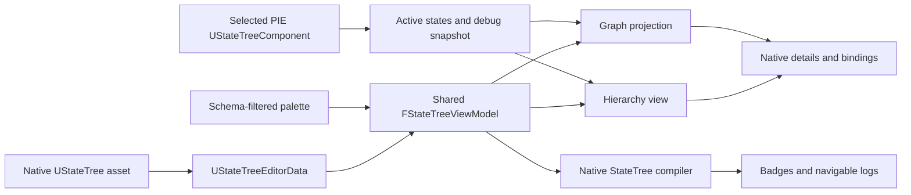

<!-- markdownlint-disable MD033 MD041 -->

<div align="center">
  
# State Tree Extensions Tool

### 전체 흐름을 보고, 모든 전이를 편집하고, 실행 중인 트리를 디버깅하세요.

[](https://www.unrealengine.com/)
[](./MCStateTreeExtensionsTool.uplugin)
[](./MCStateTreeExtensionsTool.uplugin)
[](./Source)

[English](./README.md) | **한국어**

</div>

State Tree Extensions Tool은 하나의 도킹 가능한 작업 공간에서 Unreal Engine의 네이티브 StateTree 애셋을 작성하고 디버깅할 수 있게 해주는 에디터 플러그인입니다. 기존 계층 구조, 프로퍼티 에디터, 컴파일러, 트랜잭션 및 애셋 형식을 그대로 사용하면서 StateTree의 상태 전이와 조건을 그래프로 보여줍니다.

StateTree를 별도의 커스텀 형식으로 변환하지 않습니다. `UStateTree`와 그 Editor Data가 항상 원본 데이터이며, 그래프는 해당 데이터를 에디터에서 보기 편하도록 투영한 결과입니다. 이 도구에서 수행한 변경은 Unreal Engine의 표준 StateTree 작업 흐름과 동기화됩니다.

**State Tree Extensions Tool의 주요 기능:**

- **전체 전이 지도**: 상태 노드, 그룹화된 엣지 라벨, 계층 링크, 특수 전이 대상 및 직접 재타기팅을 지원합니다.
- **집중형 하위 그래프**: Transition Condition, State Enter Condition 및 Task Parameter를 별도 그래프로 편집합니다.
- **네이티브 StateTree 편집**: Unreal의 `FStateTreeViewModel`, Editing Subsystem, Details Customization, 트랜잭션 및 컴파일러를 그대로 사용합니다.
- **검색 가능한 팔레트**: State, Task, Condition, Evaluator 및 Consideration을 검색하고 드래그 앤 드롭으로 추가합니다.
- **실시간 PIE 관찰**: 특정 실행 인스턴스 선택, 활성 상태 강조, Breakpoint, Call Stack 및 변수 값 확인을 지원합니다.
- **실행 가능한 진단 정보**: 그래프 오류 배지와 로그 항목을 통해 문제가 발생한 상태, 전이, Task 또는 Condition으로 이동합니다.

## 실행 화면

<div align="center">
  
</div>

기본 작업 공간은 왼쪽에 Transition Graph와 Log, 중앙에 StateTree 계층, 오른쪽에 Assets, Palette 및 Details를 배치합니다. 각 패널은 로컬 Tab Manager에 등록되어 있어 다른 Unreal Editor 도구처럼 자유롭게 재배치할 수 있습니다.

## 기능 개요

| 영역 | 지원 기능 |
| --- | --- |
| Assets | 네이티브 StateTree 탐색, 표준 Schema 창을 이용한 생성, Content Browser에서 찾기, Compile 및 Save |
| Hierarchy | 검색, 선택, 자식/형제 State 추가, 드래그 이동, 복사/붙여넣기, 이름 변경, 삭제 및 활성화 전환 |
| Palette | 활성 Schema가 허용하는 C++ Struct 및 Blueprint Class 기반 State, Task, Condition, Evaluator, Consideration |
| Transition Graph | State 및 계층 노드, 그룹화된 Transition Row, Trigger 선택, 추가/삭제, 드래그 재타기팅 및 수동 배치 |
| Focused Graph | Transition Condition, Enter Condition 및 Task Parameter 편집과 Breadcrumb 탐색 |
| Details | State, Task, Node 및 Asset용 네이티브 Details와 StateTree Property Binding Handler |
| Diagnostics | 네이티브 Validation/Compile, Issue Mapping, 빨간 오류 배지, 요약 Tooltip, 알림 및 이동 가능한 Log |
| PIE Debugging | 실행 인스턴스 선택, 활성 State 강조, 세션 Breakpoint, Call Stack, Global Node, Task 값 및 Linked Tree Frame |

## 빠른 시작

1. 플러그인을 활성화하고 Unreal Editor를 재시작합니다.
2. **Tools > State Tree Extensions Tool**을 엽니다.
3. **StateTree Assets**에서 기존 StateTree를 선택하거나 **New StateTree**를 누릅니다.
4. Hierarchy에서 State를 추가하거나 **State Palette**에서 드래그합니다.
5. Task, Condition 및 Consideration을 State에 드롭합니다. Evaluator는 Asset 전역에 추가됩니다.
6. **Transition Graph**에서 State를 연결하고 Transition Trigger를 선택합니다.
7. Transition Row를 더블클릭해 Condition Graph를 열거나, State를 더블클릭해 Enter Condition을 편집합니다.
8. Asset을 Compile하고 Graph Badge 또는 Log를 통해 Validation 문제를 찾습니다.
9. PIE를 시작하고 **PIE Actors**에서 관찰할 정확한 실행 Component를 선택합니다.
10. Graph State를 선택하고 <kbd>F9</kbd>를 눌러 Breakpoint를 설정하거나 해제합니다.

## Transition Graph

Transition Graph는 Unreal의 `UAIGraph`, `UEdGraphSchema` 및 `SGraphEditor` 스택을 기반으로 합니다. 별도의 데이터를 직렬화하지 않고 네이티브 StateTree Editor Data를 시각적으로 투영합니다.

- **State Node**는 State, Task, 선택 상태, PIE 활성 상태, Breakpoint 및 Compile Error를 표시합니다.
- **Hierarchy Connection**은 런타임 Transition과 함께 Parent/Child 관계를 보여줍니다.
- **Transition Edge**는 같은 Source와 Destination을 사용하는 여러 Transition을 라벨 행으로 묶습니다.
- **Trigger Picker**는 새 연결을 확정하기 전에 Transition Trigger를 선택합니다.
- **Retargeting**은 관련 없는 데이터를 다시 만들지 않고 Transition Destination만 변경합니다.
- **Special Target**은 Next, Parent, Succeeded, Failed 같은 네이티브 StateTree Link 의미를 유지합니다.
- **Manual Layout**은 임시 Graph Node Pointer가 아닌 안정적인 State GUID를 기준으로 저장됩니다.
- **Graph Edit**는 Scoped Transaction을 사용하고 Asset 수정 상태 및 공유 ViewModel에 변경을 알립니다.

Graph에서 State 또는 Task를 선택하면 Hierarchy와 Details 선택도 동기화됩니다. 현재 Graph Mode에 따라 선택 항목 삭제로 Task, State, Transition Row 또는 Condition Node를 제거할 수 있습니다.

## Condition 및 Task Graph

집중형 그래프는 Unreal Engine 내부 배열을 대체하지 않으면서 복잡하게 중첩된 데이터를 읽기 쉽게 만듭니다.

### Transition Condition

Transition Edge Row를 더블클릭하면 해당 Transition의 Condition Graph가 열립니다. 각 Condition은 Expression Operator, Description 및 네이티브 Details Editor를 가진 Graph Node로 표현됩니다. Palette에서 Condition을 추가하고, 삭제하거나 Expression Indent를 변경하고, 값을 즉시 편집할 수 있습니다.

### Enter Condition

State Node를 더블클릭하면 해당 State의 Enter Condition 전용 편집기가 열립니다. Graph는 State Context를 유지하며 Breadcrumb을 통해 Transition Overview로 돌아갈 수 있습니다.

### Task Parameter

Task Row에서 Task Parameter Graph를 열 수 있습니다. 같은 Graph 중심 작업 흐름에서 Task Data와 Property Binding을 확인하며, 선택 상태는 Hierarchy 하단의 Task Details와 동기화됩니다.

## Hierarchy 및 Palette

Hierarchy는 Unreal Engine의 네이티브 StateTree 편집 규약을 따릅니다.

- Parent/Child 및 Sibling 추가는 공유 `FStateTreeViewModel`을 사용합니다.
- 검색 결과의 상위 State를 함께 표시하여 문맥을 유지합니다.
- State Row에서 Task와 Transition 요약을 확인할 수 있습니다.
- Context Menu에서 Add Child, Add Sibling, Copy, Paste As Child, Rename, Delete 및 State Enabled를 실행할 수 있습니다.
- 모든 구조 변경은 Unreal Editor의 Undo/Redo 트랜잭션에 참여합니다.

Palette는 StateTree Node Class Cache에서 항목을 수집하고 활성 StateTree Schema의 `IsStructAllowed` 및 `IsClassAllowed` 필터를 적용합니다. 네이티브 Struct 및 Blueprint Node Class를 지원합니다.

- State Type
- Task
- Condition
- Evaluator
- Consideration

드래그 앤 드롭 시 각 항목은 네이티브 위치로 들어갑니다. Task, Condition 및 Consideration은 State에 속하며, Evaluator는 Asset의 Global Editor Data에 추가됩니다.

## Compile 및 진단

Compile은 커스텀 Validator가 아닌 Unreal Engine의 StateTree Validation과 Compiler를 사용합니다.

1. Editor Subsystem을 통해 Asset을 Validate하고 Compile합니다.
2. Compiler Message를 플러그인 Issue List로 수집합니다.
3. State, Transition, Task 및 Condition GUID를 Graph Target에 매핑합니다.
4. 영향을 받은 Node와 Edge Row에 빨간 오류 Badge와 통합 Tooltip을 표시합니다.
5. Message를 **StateTree Log** 및 Unreal의 표준 `StateTreeCompiler` Message Listing으로 전달합니다.

매핑된 Log Entry를 더블클릭하면 관련 Graph Node로 이동합니다. Transition 또는 Enter Condition 문제인 경우 집중형 Condition Graph를 먼저 열고 정확한 Node를 선택합니다.

Compile Toolbar는 Unreal의 전역 StateTree **Save on Compile** 설정도 공유합니다.

- **Never**
- **On Success Only**
- **Always**

수정된 Editor Data를 저장할 때는 먼저 Compile하며, Unreal Editor의 일반 Package Save 및 Source Control Checkout 흐름을 사용합니다.

## PIE 디버깅

Runtime Observation은 의도적으로 PIE에서만 동작합니다. 플러그인이 별도의 Preview World를 생성하거나 소유하지 않습니다.

### 하나의 실행 인스턴스 선택

**PIE Actors** 메뉴는 PIE World에서 실행 중인 `UStateTreeComponent`를 나열합니다. 항목을 선택하면 다음과 같이 동작합니다.

- 해당 Component가 사용하는 StateTree로 Editor Asset을 전환합니다.
- 관찰 대상을 그 Component 하나로 고정합니다.
- 여러 Actor의 Highlight가 합쳐지는 것을 방지합니다.
- PIE 종료 또는 Component 무효화 시 안전하게 관찰을 해제합니다.

### 활성 State 강조

선택한 인스턴스의 Active State GUID를 Polling해 Hierarchy와 Graph에 함께 표시합니다. 인스턴스를 선택하지 않았거나 Asset이 일치하지 않거나 실행이 중단되면 빈 집합을 반환해 Highlight가 자동으로 사라집니다.

### State Breakpoint

하나 이상의 State Graph Node를 선택하고 <kbd>F9</kbd>를 누릅니다. Breakpoint는 현재 Editor Session에서만 유지되며 StateTree Asset에는 저장되지 않습니다. 관찰 중인 인스턴스가 지정된 State에 새로 진입하면 Unreal의 Editor Debug Pause Mechanism을 통해 PIE World를 일시 정지합니다.

Breakpoint를 해제하면 해당 Breakpoint로 발생한 Pause를 재개하고 Debug Panel을 갱신합니다. Transition Edge와 Condition Node에는 State Breakpoint를 설정할 수 없습니다.

### Debug Snapshot

**Debug** 탭은 관찰 중인 Component에서 다음 정보를 실시간 Snapshot으로 생성합니다.

- Root에서 Leaf 순서의 Active State Call Stack
- Global Evaluator 및 Global Task
- Active State가 소유한 Task
- 별도로 표시되는 Linked StateTree Frame
- `Name = Value` 형태로 Reflection Export된 Instance Property
- Breakpoint Pause 동안 고정된 변수 값

현재 편집 중인 Asset에 속한 Call Stack Row를 선택하면 Tree, Details 및 Graph 선택이 동기화됩니다. Linked Asset Frame은 Context로 표시하지만 현재 Graph의 State처럼 선택하지는 않습니다.

## 작업 공간 참조

| Tab | 역할 |
| --- | --- |
| State Tree | 검색 가능한 네이티브 Hierarchy, State/Task 선택 및 구조 편집 |
| StateTree Assets | Asset Picker 및 New StateTree 기능 |
| State Palette | 드래그 가능한 State와 허용된 Node Type |
| Transition Graph | 전체 Transition과 Condition/Task 하위 Graph |
| Details | 선택한 State, Task, Transition 또는 Condition Property |
| Asset Details | StateTree Editor Data Property |
| StateTree Log | Edit, Transition, Condition, Compile 및 Breakpoint Message |
| Debug | PIE Call Stack 및 Instance Value |

Menu Bar는 일반적인 Asset Editor와 동일한 **File**, **Edit**, **Asset**, **Window**, **Tools**, **Help** 구조입니다. Asset Picker 열기, Save, Undo/Redo, Compile, Content Browser에서 찾기, 공식 StateTree Editor에서 열기, Tab 복원 및 StateTree 문서 열기 명령을 제공합니다.

## 동작 구조



Controller는 선택된 Asset과 공유 ViewModel을 소유하고, Panel 간 선택 동기화, Log 수집, Compiler Message Mapping, 선택된 PIE Component 관찰을 담당합니다. Hierarchy와 Graph는 독립적인 Runtime StateTree 정의를 유지하지 않습니다.

## 소스 구성

| 구성 요소 | 역할 |
| --- | --- |
| `MCStateTreeExtensionsToolEditorModule` | Plugin Startup, Slate Style 및 Tools Menu의 Nomad Tab 등록 |
| `SMCStateTreeExtensionsToolWindow` | Menu, Toolbar, Status, Dock Layout 및 Panel 수명 관리 |
| `FMCStateTreeExtensionsToolController` | Asset/ViewModel 소유, Compile/Save, Edit 연결, PIE 관찰, Breakpoint 및 Debug Snapshot |
| `SMCStateTreeHierarchyView` / `SMCStateTreeStateRow` | 네이티브 Hierarchy 편집 및 State/Task 표시 |
| `SMCStateTreeItemPalette` | Class 검색, Schema Filtering, Drag-and-Drop Payload 및 Blueprint 생성 |
| `UMCStateTreeTransitionGraph` | State/Transition 투영, Graph Schema, 편집 및 위치 저장 |
| `UMCStateTreeConditionGraph` | Transition Condition, Enter Condition, Task Parameter 및 Expression 편집 |
| `SMCStateTreeTransitionGraphPanel` | Graph Mode, Breadcrumb, Command, 선택 동기화 및 Palette Drop |
| `SMCStateTreeTransitionGraphNode` | State, Edge, Condition, Result 및 Parameter Node용 Slate Widget |
| `SMCStateTreeLogPanel` | Navigation Target을 지원하는 Categorized Buffered Log |
| `SMCStateTreeDebugView` | 실시간 PIE Call Stack 및 변수 표시 |
| `MCStateTreeVersionCompat` | 지원하는 Engine Version 간 API 차이 흡수 |
| `MCStateTreeExtensionsToolLayoutExt` | UE 5.8에서 Asset이 Graph Position을 소유하도록 하는 Editor Data Extension |

## 호환성

| Unreal Engine | 상태 | 수동 Graph Layout 저장 위치 |
| --- | --- | --- |
| 5.5.4 | 지원 | 사용자별 Editor Settings |
| 5.6 | 지원 | 사용자별 Editor Settings |
| 5.7 | 지원 | 사용자별 Editor Settings |
| 5.8 | 지원 | Asset에 저장되는 StateTree Editor Data Extension |

Main Build Rule은 UE 5.6, 5.7 및 5.8에서 추가된 API를 위한 Compatibility Gate를 정의합니다. UE 5.8에서는 Editor Module이 작은 `MCStateTreeExtensionsToolLayoutExt` Module에 조건부로 의존합니다. 이전 버전은 Graph Position 저장에 `UMCStateTreeExtensionsToolUserSettings`를 사용합니다.

> [!IMPORTANT]
> 사용자별 Editor Settings에 저장된 Layout은 로컬 Editor 설정에만 존재합니다. UE 5.8의 Asset Extension Layout은 StateTree Asset과 함께 이동하며 Compiled StateTree Hash 계산에서는 제외됩니다.

## 요구 사항

- Unreal Engine 5.5.4, 5.6, 5.7 또는 5.8
- C++ Unreal Engine Project와 해당 버전에 맞는 Compiler Toolchain
- Unreal Engine **StateTree** Plugin
- Unreal Engine **Gameplay StateTree** Plugin
- Editor Target. 이 플러그인은 Runtime 또는 Shipping Module이 아닙니다.

## 설치

1. Unreal Editor를 종료합니다.
2. 저장소를 `YourProject/Plugins/MCStateTreeExtensionsTool`에 복사하거나 Clone합니다.
3. 해당 폴더 바로 아래에 `MCStateTreeExtensionsTool.uplugin`이 있는지 확인합니다.
4. Project IDE File을 다시 생성합니다.
5. 현재 Platform의 **Development Editor** 구성으로 Project를 Build합니다.
6. Project를 열고 **Edit > Plugins > Editor**에서 **State Tree Extensions Tool**을 활성화합니다.
7. 안내가 표시되면 Unreal Editor를 재시작합니다.

```text
YourProject/
`-- Plugins/
    `-- MCStateTreeExtensionsTool/
        |-- MCStateTreeExtensionsTool.uplugin
        |-- Resources/
        `-- Source/
```

> [!NOTE]
> Prebuilt Binary는 정확한 Unreal Engine Build 및 C++ Toolchain과 일치해야 합니다. 호환되는 Binary가 포함되어 있지 않다면 Source에서 Plugin을 Build하세요.

## 소스 빌드

표준 Unreal Engine Plugin Build 절차를 사용합니다.

1. 사용 중인 Unreal Engine Version에 필요한 C++ Workload를 설치합니다.
2. Host Project의 `.uproject`에서 Project File을 생성합니다.
3. 생성된 Solution 또는 Workspace를 엽니다.
4. **Development Editor**와 대상 Platform을 선택합니다.
5. Host Project의 Editor Target을 Build합니다.

플러그인은 `StateTreeEditorModule`, `GraphEditor`, `AIGraph`, `PropertyEditor`, `UnrealEd`, `AssetTools` 및 `GameplayStateTreeModule` 등의 Editor Module에 의존합니다.

## 검증

Source에는 Graph Rebuild 및 Automatic Layout 동작을 확인하는 Unreal Automation Test가 포함되어 있습니다. 변경 시 Automation 외에도 다음 항목을 수동 확인하는 것이 좋습니다.

- Asset 전환과 선택 동기화
- State 추가, 삭제, 이동, 이름 변경 및 Undo/Redo
- Transition 생성, Trigger 선택, 삭제 및 Retargeting
- Condition 및 Task 집중형 Graph Navigation
- Compile 성공/실패, Graph Badge 및 Log Navigation
- Asset을 다시 열었을 때 Layout 복원
- PIE Instance 선택, Highlight 격리, Breakpoint Pause/Resume 및 Debug Value
- 변경의 영향을 받는 모든 지원 Engine Version에서의 동작

## 현재 제한 사항

- Runtime Observation에는 PIE와 실행 중인 `UStateTreeComponent`가 필요합니다.
- Breakpoint는 현재 Editor Session에서만 유지됩니다.
- UE 5.5.4부터 5.7까지 Manual Graph Layout은 사용자별로 저장됩니다.
- Linked StateTree Frame은 Debug에서 볼 수 있지만 현재 Asset Graph에서는 해당 State를 선택할 수 없습니다.
- Editor 전용 Source Plugin이며 독립적인 Runtime StateTree System을 제공하지 않습니다.

## 기여

Issue와 목적이 명확한 Pull Request를 환영합니다. 문제를 제보할 때 다음 정보를 포함해 주세요.

- 정확한 Unreal Engine Version 및 Patch Version
- 재현 절차와 관련 StateTree 구조
- Compiler, StateTree Log 또는 Output Log Message
- 공식 StateTree Editor에서도 같은 문제가 발생하는지 여부
- 가능하다면 최소 Sample Asset 또는 Screenshot

변경 사항은 네이티브 StateTree Data Model을 유지해야 하며 Transaction, Undo/Redo, Compile, Package Save, Graph Rebuild 및 PIE 종료 처리를 검증해야 합니다.

## 프로젝트 상태

Version `1.0.0`은 Unreal Editor 작업 흐름을 대상으로 합니다. 특히 Engine Version 간 StateTree Asset 또는 Graph Layout을 이동하는 경우 Production Pipeline에 도입하기 전에 Branch 또는 Project 복사본에서 평가하세요.

## 감사의 말

Unreal Engine의 StateTree, Gameplay StateTree, GraphEditor, AIGraph, Slate, Details Customization 및 Editor Extensibility API를 기반으로 제작되었습니다.

